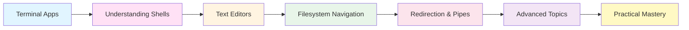

# Terminal Basics Training Plan

## Overview

This training plan is designed for a mixed audience, covering terminal fundamentals from beginner to intermediate level. Whether you're new to the command line or looking to strengthen your skills, this guide provides a structured learning path with hands-on exercises.

## Learning Path



---

## 1. Terminal Applications

### What is a Terminal?

A terminal (or terminal emulator) is an application that provides a text-based interface to interact with your computer's operating system. It allows you to execute commands, run programs, and manage files using text commands instead of graphical interfaces.

### Mac Terminal Options

#### Built-in Option

**Terminal.app**
- Pre-installed on every Mac
- Location: `/Applications/Utilities/Terminal.app`
- Pros: No installation needed, reliable, integrates well with macOS
- Cons: Limited customization, basic feature set
- Best for: Beginners, quick tasks, system administration

#### Popular Alternatives

**iTerm2** (Recommended for Mac users)
- Website: https://iterm2.com
- Pros: 
  - Split panes for multiple sessions
  - Extensive customization options
  - Search functionality
  - Hotkey window for quick access
  - Better color schemes and fonts
- Cons: Requires installation
- Best for: Power users, developers, anyone spending significant time in terminal

**Terminus**
- Website: https://eugeny.github.io/terminus/
- Pros:
  - Cross-platform (Mac, Windows, Linux)
  - Modern, sleek interface
  - Plugin system for extensions
  - Integrated SSH and serial connections
- Cons: Electron-based (higher resource usage)
- Best for: Users who work across multiple operating systems

**Other Options**
- **Warp**: Modern terminal with AI features and IDE-like capabilities
- **Alacritty**: GPU-accelerated, extremely fast, minimal features
- **Kitty**: GPU-accelerated with advanced features and scripting

### PC Terminal Options

**Note**: This guide focuses on Mac. Windows coverage may be added in future versions.

For PC users, consider:
- Windows Terminal (Windows 10/11)
- PowerShell
- WSL (Windows Subsystem for Linux) with any Linux terminal

### Getting Started

1. **Open your terminal application**
   - Mac: Press `Cmd + Space`, type "Terminal", press Enter
   - Or navigate to Applications → Utilities → Terminal

2. **Basic terminal anatomy**
   ```
   username@computername:~$
   ```
   - `username`: Your user account name
   - `computername`: Your computer's name
   - `~`: Current directory (~ means home directory)
   - `$`: Command prompt (ready for input)

3. **Your first command**
   ```bash
   echo "Hello, Terminal!"
   ```

### Exercise 1.1: Terminal Setup

1. Open your default terminal application
2. Try the `echo` command above
3. Type `whoami` to see your username
4. Type `hostname` to see your computer's name
5. (Optional) Install iTerm2 and compare the experience


## 2. Understanding Shells

### What is a Shell?

A shell is a command-line interpreter that provides a user interface to access the operating system's services. When you type commands in a terminal, you're actually interacting with a shell program that interprets and executes those commands.

```
┌─────────────────┐
│   Terminal App  │  (iTerm2, Terminal.app, etc.)
└────────┬────────┘
         │
┌────────▼────────┐
│     Shell       │  (bash, zsh, sh, etc.)
└────────┬────────┘
         │
┌────────▼────────┐
│  Operating      │
│  System         │
└─────────────────┘
```

### Shell Types Overview

#### sh (Bourne Shell)
- **The Original**: Created by Stephen Bourne at Bell Labs (1979)
- **Location**: `/bin/sh`
- **Characteristics**:
  - Minimal and lightweight
  - POSIX compliant (standard for Unix shells)
  - Available on virtually every Unix/Linux system
  - Limited features compared to modern shells
- **Use Cases**:
  - Writing portable shell scripts
  - System scripts that need maximum compatibility
  - Embedded systems with limited resources

```bash
# Check if sh is available
which sh
# Output: /bin/sh

# Run sh
sh
```

#### bash (Bourne Again Shell)
- **The Workhorse**: GNU's enhanced version of sh (1989)
- **Location**: `/bin/bash`
- **Characteristics**:
  - Backward compatible with sh
  - Rich feature set (command history, tab completion, aliases)
  - Extensive scripting capabilities
  - Default shell on most Linux distributions
  - Default on macOS until Catalina (10.15)
- **Use Cases**:
  - General-purpose shell for daily use
  - Shell scripting (most common)
  - System administration
  - Cross-platform compatibility

```bash
# Check bash version
bash --version

# Check if bash is your current shell
echo $SHELL

# Run bash
bash
```

**Key bash Features:**
```bash
# Command history
history

# Tab completion
cd Doc[Tab]  # Completes to Documents/

# Command substitution
echo "Today is $(date)"

# Brace expansion
echo file{1,2,3}.txt  # Outputs: file1.txt file2.txt file3.txt

# Conditional execution
mkdir newdir && cd newdir  # cd only if mkdir succeeds
```

#### zsh (Z Shell)
- **The Modern Choice**: Extended Bourne shell with many improvements (1990)
- **Location**: `/bin/zsh`
- **Characteristics**:
  - Combines features from bash, ksh, and tcsh
  - Superior tab completion
  - Spelling correction
  - Themeable prompts
  - Plugin ecosystem
  - **Default shell on macOS since Catalina (10.15)**
- **Use Cases**:
  - Interactive use (excellent user experience)
  - Power users who want customization
  - macOS users (default shell)

```bash
# Check zsh version
zsh --version

# Check if zsh is your current shell
echo $SHELL
# Output on modern Mac: /bin/zsh

# Run zsh
zsh
```

**Key zsh Features:**
```bash
# Advanced tab completion (case-insensitive, partial matching)
cd doc[Tab]  # Matches Documents/ even with lowercase

# Spelling correction
cd Documnets
# zsh: correct 'Documnets' to 'Documents' [nyae]?

# Glob qualifiers
ls *.txt(.)      # Only files
ls *(/)          # Only directories
ls *(.m-2)       # Files modified in last 2 days

# Shared command history across sessions
# Commands from one terminal appear in another
```

#### ksh (Korn Shell)
- **The Enterprise Shell**: Developed by David Korn at Bell Labs (1983)
- **Characteristics**:
  - Combines features of sh and csh
  - Popular in enterprise Unix environments
  - Less common on modern systems
- **Note**: Not covered in detail here; mentioned for completeness

### Shell Comparison

| Feature | sh | bash | zsh |
|---------|----|----|-----|
| POSIX Compliant | ✅ | ✅ | ✅ |
| Tab Completion | Basic | Good | Excellent |
| Command History | No | Yes | Yes (shared) |
| Spelling Correction | No | No | Yes |
| Themes/Plugins | No | Limited | Extensive |
| Scripting | Basic | Advanced | Advanced |
| Speed | Fast | Moderate | Moderate |
| Customization | Minimal | Good | Excellent |
| Default on macOS | Old versions | Until 10.14 | 10.15+ |
| Default on Linux | System scripts | Most distros | Some distros |

### Checking Your Current Shell

```bash
# Method 1: Check SHELL environment variable
echo $SHELL
# Output examples:
# /bin/bash
# /bin/zsh

# Method 2: Check current process
ps -p $$
# Shows the current shell process

# Method 3: Check with environment
echo $0
# Output: -bash, -zsh, etc.
```

### Switching Between Shells

```bash
# Temporarily switch to bash
bash

# Temporarily switch to zsh
zsh

# Temporarily switch to sh
sh

# Exit back to previous shell
exit

# Change default shell permanently (requires password)
chsh -s /bin/zsh        # Switch to zsh
chsh -s /bin/bash       # Switch to bash

# Note: After changing default shell, log out and back in
```

### Shell Configuration Files

Each shell reads configuration files on startup. Understanding these is crucial for customization.

#### bash Configuration Files

```bash
# System-wide configuration
/etc/profile            # Loaded for login shells
/etc/bashrc            # Loaded for interactive shells

# User-specific configuration (in order of loading)
~/.bash_profile        # Login shells (macOS)
~/.bash_login          # Login shells (if .bash_profile doesn't exist)
~/.profile             # Login shells (if neither above exists)
~/.bashrc              # Interactive non-login shells (Linux)

# Logout
~/.bash_logout         # Executed when login shell exits
```

**macOS bash setup:**
```bash
# Edit your bash profile
nano ~/.bash_profile

# Add customizations:
export PATH="$PATH:$HOME/bin"
alias ll='ls -lah'
export EDITOR=nano

# Reload configuration
source ~/.bash_profile
```

#### zsh Configuration Files

```bash
# System-wide configuration
/etc/zshenv            # Always loaded
/etc/zprofile          # Login shells
/etc/zshrc             # Interactive shells
/etc/zlogin            # Login shells (after zshrc)

# User-specific configuration (in order of loading)
~/.zshenv              # Always loaded (environment variables)
~/.zprofile            # Login shells
~/.zshrc               # Interactive shells (main config file)
~/.zlogin              # Login shells (after zshrc)

# Logout
~/.zlogout             # Executed when login shell exits
```

**macOS zsh setup:**
```bash
# Edit your zsh config (main file)
nano ~/.zshrc

# Add customizations:
export PATH="$PATH:$HOME/bin"
alias ll='ls -lah'
export EDITOR=nano

# Reload configuration
source ~/.zshrc
```

### oh-my-zsh: Supercharging zsh

**oh-my-zsh** is a popular open-source framework for managing zsh configuration. It provides:
- 300+ plugins (git, docker, kubectl, etc.)
- 150+ themes for beautiful prompts
- Auto-update functionality
- Community-driven development

#### Installing oh-my-zsh

```bash
# Prerequisites: zsh must be installed and set as default shell

# Install via curl
sh -c "$(curl -fsSL https://raw.githubusercontent.com/ohmyzsh/ohmyzsh/master/tools/install.sh)"

# Or via wget
sh -c "$(wget -O- https://raw.githubusercontent.com/ohmyzsh/ohmyzsh/master/tools/install.sh)"

# Installation creates ~/.oh-my-zsh/ directory
# and backs up existing ~/.zshrc to ~/.zshrc.pre-oh-my-zsh
```

#### Configuring oh-my-zsh

```bash
# Edit configuration
nano ~/.zshrc

# Key settings:

# 1. Choose a theme
ZSH_THEME="robbyrussell"     # Default
# ZSH_THEME="agnoster"       # Popular alternative
# ZSH_THEME="powerlevel10k/powerlevel10k"  # Advanced

# 2. Enable plugins
plugins=(
  git                        # Git aliases and functions
  zsh-autosuggestions       # Fish-like autosuggestions
  zsh-syntax-highlighting   # Syntax highlighting
  docker                    # Docker completion
  kubectl                   # Kubernetes completion
  macos                     # macOS-specific aliases
)

# 3. Reload configuration
source ~/.zshrc
```

#### Popular oh-my-zsh Plugins

```bash
# git - Git shortcuts
gs      # git status
ga      # git add
gc      # git commit
gp      # git push
gl      # git pull

# zsh-autosuggestions (install separately)
git clone https://github.com/zsh-users/zsh-autosuggestions ${ZSH_CUSTOM:-~/.oh-my-zsh/custom}/plugins/zsh-autosuggestions

# zsh-syntax-highlighting (install separately)
git clone https://github.com/zsh-users/zsh-syntax-highlighting.git ${ZSH_CUSTOM:-~/.oh-my-zsh/custom}/plugins/zsh-syntax-highlighting

# Then add to plugins in ~/.zshrc:
plugins=(git zsh-autosuggestions zsh-syntax-highlighting)
```

#### oh-my-zsh Themes

```bash
# View available themes
ls ~/.oh-my-zsh/themes/

# Popular themes:
# - robbyrussell (default, minimal)
# - agnoster (requires powerline fonts)
# - powerlevel10k (highly customizable, fast)
# - spaceship (feature-rich)

# Change theme in ~/.zshrc
ZSH_THEME="agnoster"

# Apply changes
source ~/.zshrc

# Preview themes without changing config
# Each theme file can be sourced temporarily
```

#### oh-my-zsh Commands

```bash
# Update oh-my-zsh
omz update

# Reload configuration
omz reload

# List plugins
omz plugin list

# Enable plugin
omz plugin enable docker

# Disable plugin
omz plugin disable docker
```

### Shell Scripting Basics

#### Shebang Line

The first line of a shell script specifies which interpreter to use:

```bash
#!/bin/sh          # Use sh (most portable)
#!/bin/bash        # Use bash (most common)
#!/usr/bin/env bash # Use bash from PATH (more portable)
#!/bin/zsh         # Use zsh
```

#### Creating a Simple Script

```bash
# Create script file
nano myscript.sh

# Add content:
#!/bin/bash

echo "Hello from bash!"
echo "Current directory: $(pwd)"
echo "Current user: $(whoami)"

# Save and exit

# Make executable
chmod +x myscript.sh

# Run script
./myscript.sh
```

#### sh vs bash in Scripts

**sh script (maximum portability):**
```bash
#!/bin/sh
# Use only POSIX features
# No arrays, no [[ ]], no bash-specific features

if [ -f "file.txt" ]; then
    echo "File exists"
fi
```

**bash script (more features):**
```bash
#!/bin/bash
# Can use bash-specific features

# Arrays
files=("file1.txt" "file2.txt" "file3.txt")

# Advanced conditionals
if [[ -f "file.txt" && -r "file.txt" ]]; then
    echo "File exists and is readable"
fi

# String manipulation
text="Hello World"
echo "${text,,}"  # Convert to lowercase
```

### Best Practices

1. **For Interactive Use:**
   - macOS: Use zsh (default) with oh-my-zsh
   - Linux: Use bash or zsh based on preference
   - Customize with aliases and functions

2. **For Shell Scripts:**
   - Use `#!/bin/sh` for maximum portability
   - Use `#!/bin/bash` when you need bash features
   - Test scripts on target systems
   - Use shellcheck for linting: `shellcheck script.sh`

3. **Configuration:**
   - Keep configurations in version control (dotfiles)
   - Document custom aliases and functions
   - Separate machine-specific configs from portable ones

4. **Learning Path:**
   - Start with bash (most common, good documentation)
   - Learn sh for writing portable scripts
   - Explore zsh for enhanced interactive experience
   - Add oh-my-zsh when comfortable with zsh basics

### Exercise 2.1: Shell Exploration

```bash
# 1. Check your current shell
echo $SHELL
ps -p $$

# 2. Check available shells
cat /etc/shells

# 3. Try different shells
bash
echo "I'm in bash: $BASH_VERSION"
exit

zsh
echo "I'm in zsh: $ZSH_VERSION"
exit

# 4. Create a simple bash script
cat > hello.sh << 'EOF'
#!/bin/bash
echo "Hello from bash!"
echo "Script name: $0"
echo "First argument: $1"
echo "All arguments: $@"
EOF

chmod +x hello.sh
./hello.sh world test

# 5. Create a portable sh script
cat > portable.sh << 'EOF'
#!/bin/sh
echo "This works in any POSIX shell"
if [ -d "$HOME" ]; then
    echo "Home directory: $HOME"
fi
EOF

chmod +x portable.sh
./portable.sh

# 6. (Optional) Install oh-my-zsh if using zsh
# Follow installation instructions above

# 7. Clean up
rm hello.sh portable.sh
```

### Quick Reference: Shell Commands

```bash
# Shell information
echo $SHELL              # Current default shell
echo $0                  # Current running shell
bash --version           # bash version
zsh --version            # zsh version

# Switch shells
bash                     # Start bash
zsh                      # Start zsh
sh                       # Start sh
exit                     # Exit current shell

# Change default shell
chsh -s /bin/bash        # Set bash as default
chsh -s /bin/zsh         # Set zsh as default

# Configuration
source ~/.bashrc         # Reload bash config
source ~/.zshrc          # Reload zsh config
nano ~/.bashrc           # Edit bash config
nano ~/.zshrc            # Edit zsh config
```

---

---

## 3. Text Editors

Working in the terminal often requires editing files. Two essential editors you should know are **nano** (beginner-friendly) and **vim** (powerful but steeper learning curve).

### nano - The Beginner-Friendly Editor

**Why nano?**
- Simple and intuitive
- Commands displayed at bottom of screen
- No modes to worry about
- Great for quick edits

**Basic Usage**

```bash
# Create or edit a file
nano filename.txt

# Common commands (shown at bottom):
# ^X = Exit (Ctrl+X)
# ^O = Save (WriteOut)
# ^K = Cut line
# ^U = Paste (UnCut)
# ^W = Search
# ^\ = Search and replace
```

**nano Quick Reference**

| Action | Command |
|--------|---------|
| Save file | `Ctrl + O`, then Enter |
| Exit | `Ctrl + X` |
| Cut line | `Ctrl + K` |
| Paste | `Ctrl + U` |
| Search | `Ctrl + W` |
| Go to line | `Ctrl + _` |
| Show line numbers | `Alt + #` (or `Esc + #`) |

### vim - The Power User's Editor

**Why vim?**
- Extremely powerful and efficient
- Available on virtually every Unix system
- Modal editing allows for complex operations
- Highly customizable

**The vim Survival Guide**

vim operates in different "modes":
- **Normal mode**: Navigate and execute commands (default)
- **Insert mode**: Type and edit text
- **Visual mode**: Select text
- **Command mode**: Execute commands (save, quit, etc.)

**Essential vim Commands**

```bash
# Open a file
vim filename.txt

# SURVIVAL COMMANDS (memorize these first!)
i          # Enter INSERT mode (start typing)
Esc        # Return to NORMAL mode
:w         # Save (write) file
:q         # Quit
:wq        # Save and quit
:q!        # Quit without saving (force quit)
```

**vim Quick Reference - Normal Mode**

| Action | Command |
|--------|---------|
| Enter insert mode | `i` (before cursor), `a` (after cursor), `o` (new line below) |
| Delete character | `x` |
| Delete line | `dd` |
| Undo | `u` |
| Redo | `Ctrl + r` |
| Copy line | `yy` |
| Paste | `p` |
| Search | `/searchterm` then Enter |
| Next search result | `n` |
| Go to line number | `:42` (goes to line 42) |
| Go to end of file | `G` |
| Go to start of file | `gg` |

**vim Quick Reference - Insert Mode**

| Action | Command |
|--------|---------|
| Exit insert mode | `Esc` |
| Everything else | Type normally! |

### When to Use Which Editor?

**Use nano when:**
- Making quick edits
- You're a beginner
- You need to edit system files (less risk of mistakes)
- Working on a remote server with limited time

**Use vim when:**
- You need powerful editing features
- Working with large files
- You want to be more efficient (after learning)
- You'll be doing a lot of terminal-based editing

### Exercise 3.1: Editor Practice

**nano practice:**
```bash
# Create a new file
nano practice.txt

# Type some text, save with Ctrl+O, exit with Ctrl+X
# Open it again and add more text
nano practice.txt
```

**vim practice:**
```bash
# Create a new file
vim vimpractice.txt

# Follow these steps:
# 1. Press 'i' to enter insert mode
# 2. Type: "Learning vim is challenging but rewarding"
# 3. Press Esc to return to normal mode
# 4. Type ':wq' and press Enter to save and quit

# Open it again to practice more
vim vimpractice.txt

# Try these:
# - Press 'o' to add a new line below
# - Type another sentence
# - Press Esc, then 'dd' to delete the line
# - Press 'u' to undo
# - Type ':q!' to quit without saving
```

---

## 4. Filesystem Navigation

Understanding how to navigate and manipulate the filesystem is fundamental to terminal proficiency.

### Understanding the Filesystem Hierarchy

**Unix/Mac Filesystem Structure:**
```
/                          (root - top of filesystem)
├── Users/                 (user home directories)
│   └── yourname/         (your home directory, also ~)
│       ├── Documents/
│       ├── Downloads/
│       ├── Desktop/
│       └── ...
├── Applications/          (installed applications)
├── System/               (system files)
├── Library/              (system libraries)
└── tmp/                  (temporary files)
```

### Essential Navigation Commands

#### pwd - Print Working Directory
Shows your current location in the filesystem.

```bash
pwd
# Output: /Users/yourname
```

#### ls - List Files and Directories
Display contents of a directory.

```bash
# Basic listing
ls

# Long format (detailed)
ls -l

# Show hidden files (files starting with .)
ls -a

# Long format with hidden files
ls -la

# Human-readable file sizes
ls -lh

# Sort by modification time
ls -lt

# Reverse sort order
ls -lr
```

**Understanding ls -l output:**
```
-rw-r--r--  1 user  staff  1234 Jan 29 10:30 file.txt
│││││││││  │  │     │     │    │         │
│││││││││  │  │     │     │    │         └─ filename
│││││││││  │  │     │     │    └─ modification date/time
│││││││││  │  │     │     └─ file size (bytes)
│││││││││  │  │     └─ group
│││││││││  │  └─ owner
│││││││││  └─ number of links
└─────────── permissions (covered in Section 5)
```

#### cd - Change Directory
Navigate between directories.

```bash
# Go to home directory
cd
cd ~

# Go to specific directory
cd /Users/yourname/Documents

# Go up one level
cd ..

# Go up two levels
cd ../..

# Go to previous directory
cd -

# Go to root directory
cd /
```

#### mkdir - Make Directory
Create new directories.

```bash
# Create a single directory
mkdir newfolder

# Create nested directories
mkdir -p projects/web/css

# Create multiple directories
mkdir folder1 folder2 folder3
```

#### rm - Remove Files and Directories
Delete files and directories (use with caution!).

```bash
# Remove a file
rm file.txt

# Remove multiple files
rm file1.txt file2.txt

# Remove directory and contents (recursive)
rm -r foldername

# Force remove without confirmation
rm -f file.txt

# Remove directory recursively with force
rm -rf foldername

# Interactive mode (asks for confirmation)
rm -i file.txt
```

**⚠️ Warning**: `rm` is permanent! There's no trash/recycle bin. Be especially careful with `rm -rf`.

#### cp - Copy Files and Directories
Copy files and directories.

```bash
# Copy a file
cp source.txt destination.txt

# Copy to a directory
cp file.txt /path/to/directory/

# Copy directory recursively
cp -r sourcedir/ destdir/

# Copy with verbose output
cp -v file.txt newfile.txt

# Copy and preserve attributes (timestamps, permissions)
cp -p file.txt backup.txt
```

#### mv - Move or Rename Files
Move or rename files and directories.

```bash
# Rename a file
mv oldname.txt newname.txt

# Move file to directory
mv file.txt /path/to/directory/

# Move multiple files
mv file1.txt file2.txt /destination/

# Move directory
mv olddir/ newdir/
```

### Paths: Absolute vs Relative

**Absolute Path**
- Starts from root directory (/)
- Always works regardless of current location
- Example: `/Users/yourname/Documents/file.txt`

**Relative Path**
- Relative to current directory
- Shorter and more convenient
- Examples:
  - `Documents/file.txt` (subdirectory)
  - `../file.txt` (parent directory)
  - `../../file.txt` (two levels up)

### Special Directory Symbols

| Symbol | Meaning |
|--------|---------|
| `/` | Root directory |
| `~` | Home directory |
| `.` | Current directory |
| `..` | Parent directory |
| `-` | Previous directory (with cd) |

### Wildcards and Pattern Matching

Wildcards help you work with multiple files at once.

```bash
# * matches any characters
ls *.txt                    # All .txt files
rm temp*                    # All files starting with "temp"
cp *.jpg /backup/          # All .jpg files

# ? matches single character
ls file?.txt               # file1.txt, fileA.txt, etc.

# [] matches any character in brackets
ls file[123].txt           # file1.txt, file2.txt, file3.txt
ls [A-Z]*.txt             # Files starting with uppercase letter

# {} matches any of the comma-separated patterns
cp file.{txt,md,pdf} /backup/    # Copy specific extensions
```

### Useful Navigation Tips

```bash
# Tab completion - press Tab to autocomplete
cd Doc[Tab]                # Completes to Documents/

# Double Tab shows options
cd D[Tab][Tab]            # Shows all directories starting with D

# Use up/down arrows to cycle through command history

# Ctrl+R for reverse search through history
# (Type to search, Enter to execute, Ctrl+C to cancel)
```

### Exercise 4.1: Filesystem Navigation

```bash
# 1. Check your current location
pwd

# 2. List all files including hidden ones
ls -la

# 3. Create a practice directory structure
mkdir -p practice/level1/level2

# 4. Navigate into it
cd practice/level1/level2

# 5. Check location again
pwd

# 6. Go back to practice directory
cd ../..

# 7. Create some test files
touch file1.txt file2.txt file3.md

# 8. List only .txt files
ls *.txt

# 9. Copy all .txt files to level1
cp *.txt level1/

# 10. Verify the copy
ls level1/

# 11. Clean up (be careful!)
cd ..
rm -r practice/
```

---

## 5. Redirection & Pipes

Redirection and pipes are powerful features that allow you to control where command input comes from and where output goes.

### Understanding Standard Streams

Every command has three standard streams:

1. **stdin (Standard Input)** - Stream 0
   - Where command reads input from
   - Default: keyboard

2. **stdout (Standard Output)** - Stream 1
   - Where command writes normal output
   - Default: terminal screen

3. **stderr (Standard Error)** - Stream 2
   - Where command writes error messages
   - Default: terminal screen

```
┌─────────┐
│ Command │
└─────────┘
     ↑ stdin (0)
     ↓ stdout (1)
     ↓ stderr (2)
```

### Output Redirection

#### Redirect stdout to a File

```bash
# Overwrite file with output (>)
echo "Hello World" > output.txt
ls -l > filelist.txt

# Append to file (>>)
echo "New line" >> output.txt
date >> log.txt

# Redirect stderr to a file (2>)
command-that-fails 2> errors.txt

# Redirect both stdout and stderr (&>)
command > output.txt 2>&1
# or (newer syntax)
command &> output.txt

# Redirect stdout and stderr to different files
command > output.txt 2> errors.txt
```

#### Discard Output

```bash
# Send output to /dev/null (the "black hole")
command > /dev/null           # Discard stdout
command 2> /dev/null          # Discard stderr
command &> /dev/null          # Discard both
```

### Input Redirection

```bash
# Read input from file (<)
sort < unsorted.txt

# Here document (<<)
cat << EOF > newfile.txt
Line 1
Line 2
Line 3
EOF

# Here string (<<<)
grep "pattern" <<< "text to search"
```

### Pipes (|)

Pipes connect the stdout of one command to the stdin of another, allowing you to chain commands together.

```bash
# Basic pipe
command1 | command2

# Examples:
ls -l | grep ".txt"                    # List only .txt files
cat file.txt | sort                    # Sort file contents
ps aux | grep "python"                 # Find Python processes
history | tail -20                     # Show last 20 commands
```

### Common Pipe Patterns

#### grep - Search for Patterns
```bash
# Find lines containing "error"
cat log.txt | grep "error"

# Case-insensitive search
cat log.txt | grep -i "error"

# Show line numbers
cat log.txt | grep -n "error"

# Invert match (lines NOT containing pattern)
cat log.txt | grep -v "debug"

# Count matches
cat log.txt | grep -c "error"
```

#### sort - Sort Lines
```bash
# Sort alphabetically
cat names.txt | sort

# Sort numerically
cat numbers.txt | sort -n

# Reverse sort
cat names.txt | sort -r

# Sort by column (space-delimited)
ls -l | sort -k 5 -n              # Sort by file size (5th column)
```

#### uniq - Remove Duplicates
```bash
# Remove adjacent duplicate lines (requires sorted input)
sort file.txt | uniq

# Count occurrences
sort file.txt | uniq -c

# Show only duplicates
sort file.txt | uniq -d
```

#### wc - Word Count
```bash
# Count lines, words, characters
wc file.txt

# Count only lines
wc -l file.txt

# Count files in directory
ls | wc -l
```

#### head and tail - Show Beginning or End
```bash
# First 10 lines (default)
head file.txt

# First 5 lines
head -n 5 file.txt

# Last 10 lines (default)
tail file.txt

# Last 20 lines
tail -n 20 file.txt

# Follow file (watch for new lines)
tail -f log.txt
```

### Advanced Pipe Chains

```bash
# Find largest files in current directory
ls -lh | sort -k 5 -h -r | head -10

# Count unique IP addresses in log
cat access.log | awk '{print $1}' | sort | uniq -c | sort -rn

# Find most common commands in history
history | awk '{print $2}' | sort | uniq -c | sort -rn | head -10

# Monitor system processes
ps aux | grep -v grep | grep "python" | awk '{print $2, $11}'
```

### Practical Examples

#### Example 1: Log Analysis
```bash
# Find all errors in last 100 lines of log
tail -100 /var/log/system.log | grep -i "error"

# Count error types
grep "ERROR" app.log | awk '{print $4}' | sort | uniq -c | sort -rn
```

#### Example 2: File Management
```bash
# Find and list all .txt files, sorted by size
find . -name "*.txt" -type f -exec ls -lh {} \; | sort -k 5 -h

# Create backup of all .conf files
ls *.conf | xargs -I {} cp {} {}.backup
```

#### Example 3: Text Processing
```bash
# Extract email addresses from file
grep -Eo "\b[A-Za-z0-9._%+-]+@[A-Za-z0-9.-]+\.[A-Z|a-z]{2,}\b" file.txt | sort | uniq

# Convert text to uppercase
cat file.txt | tr '[:lower:]' '[:upper:]'
```

### Exercise 5.1: Redirection and Pipes

```bash
# 1. Create a test file with numbers
echo -e "5\n2\n8\n1\n9\n2\n5" > numbers.txt

# 2. Sort the numbers
sort -n numbers.txt > sorted.txt

# 3. Remove duplicates
sort -n numbers.txt | uniq > unique.txt

# 4. Count unique numbers
sort numbers.txt | uniq | wc -l

# 5. Create a log file simulation
echo "ERROR: Connection failed" > app.log
echo "INFO: Starting service" >> app.log
echo "ERROR: Timeout occurred" >> app.log
echo "INFO: Service running" >> app.log
echo "ERROR: Database error" >> app.log

# 6. Extract only errors
grep "ERROR" app.log > errors.txt

# 7. Count errors
grep -c "ERROR" app.log

# 8. Show errors with line numbers
grep -n "ERROR" app.log

# 9. Chain multiple commands
cat app.log | grep "ERROR" | wc -l

# 10. Advanced: Find most common error
grep "ERROR" app.log | sort | uniq -c | sort -rn | head -1
```

---

## 6. Advanced Topics

### Environment Variables

Environment variables are dynamic values that affect how processes run on your system.

#### Viewing Environment Variables

```bash
# Show all environment variables
env
printenv

# Show specific variable
echo $HOME
echo $PATH
echo $USER

# Show variable with printenv
printenv HOME
```

#### Common Environment Variables

| Variable | Purpose | Example |
|----------|---------|---------|
| `HOME` | User's home directory | `/Users/yourname` |
| `PATH` | Directories to search for commands | `/usr/bin:/bin:/usr/local/bin` |
| `USER` | Current username | `yourname` |
| `SHELL` | Current shell | `/bin/bash` or `/bin/zsh` |
| `PWD` | Present working directory | `/Users/yourname/Documents` |
| `LANG` | System language | `en_US.UTF-8` |
| `EDITOR` | Default text editor | `vim` or `nano` |

#### Setting Environment Variables

```bash
# Temporary (current session only)
export MY_VAR="Hello"
echo $MY_VAR

# Add to PATH
export PATH="$PATH:/new/directory"

# Make permanent (add to shell config file)
# For bash: ~/.bash_profile or ~/.bashrc
# For zsh: ~/.zshrc
echo 'export MY_VAR="Hello"' >> ~/.zshrc

# Reload config
source ~/.zshrc
```

#### Practical Uses

```bash
# Set default editor
export EDITOR=nano

# Add custom scripts directory to PATH
export PATH="$PATH:$HOME/scripts"

# Set application-specific variables
export JAVA_HOME="/Library/Java/JavaVirtualMachines/jdk-11.jdk/Contents/Home"
export NODE_ENV="development"
```

### Command History and Shortcuts

#### Command History

```bash
# Show command history
history

# Show last 20 commands
history 20

# Execute command from history by number
!42                    # Execute command #42

# Execute last command
!!

# Execute last command starting with 'git'
!git

# Search history (Ctrl+R)
# Press Ctrl+R, type search term, press Enter to execute

# Clear history
history -c
```

#### Keyboard Shortcuts

**Navigation:**
| Shortcut | Action |
|----------|--------|
| `Ctrl + A` | Move to beginning of line |
| `Ctrl + E` | Move to end of line |
| `Ctrl + B` | Move back one character |
| `Ctrl + F` | Move forward one character |
| `Alt + B` | Move back one word |
| `Alt + F` | Move forward one word |

**Editing:**
| Shortcut | Action |
|----------|--------|
| `Ctrl + U` | Cut from cursor to beginning of line |
| `Ctrl + K` | Cut from cursor to end of line |
| `Ctrl + W` | Cut word before cursor |
| `Ctrl + Y` | Paste (yank) cut text |
| `Ctrl + L` | Clear screen |
| `Ctrl + C` | Cancel current command |
| `Ctrl + D` | Exit shell (or delete character) |

**History:**
| Shortcut | Action |
|----------|--------|
| `Ctrl + R` | Reverse search history |
| `Ctrl + P` | Previous command (↑) |
| `Ctrl + N` | Next command (↓) |
| `!!` | Repeat last command |
| `!$` | Last argument of previous command |

### Aliases

Aliases are shortcuts for longer commands. They save time and reduce typing errors.

#### Creating Aliases

```bash
# Temporary alias (current session)
alias ll='ls -lah'
alias ..='cd ..'
alias ...='cd ../..'

# Use the alias
ll

# Show all aliases
alias

# Remove alias
unalias ll
```

#### Making Aliases Permanent

Add to your shell configuration file:

```bash
# For bash: ~/.bash_profile or ~/.bashrc
# For zsh: ~/.zshrc

# Edit config file
nano ~/.zshrc

# Add aliases:
alias ll='ls -lah'
alias la='ls -A'
alias l='ls -CF'
alias ..='cd ..'
alias ...='cd ../..'
alias grep='grep --color=auto'
alias mkdir='mkdir -pv'
alias h='history'
alias c='clear'

# Git aliases
alias gs='git status'
alias ga='git add'
alias gc='git commit'
alias gp='git push'
alias gl='git log --oneline'

# Safety aliases
alias rm='rm -i'
alias cp='cp -i'
alias mv='mv -i'

# Save and reload
source ~/.zshrc
```

#### Useful Alias Examples

```bash
# Navigation
alias home='cd ~'
alias docs='cd ~/Documents'
alias dl='cd ~/Downloads'
alias desk='cd ~/Desktop'

# System
alias update='sudo softwareupdate -i -a'
alias cleanup='find . -name ".DS_Store" -delete'

# Development
alias serve='python -m http.server 8000'
alias ports='lsof -i -P | grep LISTEN'

# Utilities
alias myip='curl ifconfig.me'
alias weather='curl wttr.in'
alias sizeof='du -sh'
```

### File Permissions

Understanding file permissions is crucial for security and proper file management.

#### Permission Structure

```bash
ls -l file.txt
-rw-r--r--  1 user  staff  1234 Jan 29 10:30 file.txt
│││││││││
│└┴┴┴┴┴┴┴─ permissions
└───────── file type (- = file, d = directory, l = link)

Breakdown:
- rw- r-- r--
  │   │   │
  │   │   └── others (everyone else)
  │   └────── group
  └────────── owner (user)

Each section has three permissions:
r = read (4)
w = write (2)
x = execute (1)
- = no permission (0)
```

#### Permission Values

| Permission | Symbol | Numeric | Meaning for Files | Meaning for Directories |
|------------|--------|---------|-------------------|------------------------|
| Read | r | 4 | View file contents | List directory contents |
| Write | w | 2 | Modify file | Create/delete files in directory |
| Execute | x | 1 | Run as program | Enter directory (cd) |

#### Common Permission Patterns

| Numeric | Symbolic | Meaning |
|---------|----------|---------|
| 644 | -rw-r--r-- | Owner can read/write, others can read |
| 755 | -rwxr-xr-x | Owner can read/write/execute, others can read/execute |
| 700 | -rwx------ | Owner can read/write/execute, others have no access |
| 666 | -rw-rw-rw- | Everyone can read/write |
| 777 | -rwxrwxrwx | Everyone can read/write/execute (dangerous!) |

#### Changing Permissions with chmod

```bash
# Numeric method
chmod 644 file.txt              # rw-r--r--
chmod 755 script.sh             # rwxr-xr-x
chmod 700 private.txt           # rwx------

# Symbolic method
chmod u+x script.sh             # Add execute for user
chmod g-w file.txt              # Remove write for group
chmod o+r file.txt              # Add read for others
chmod a+x script.sh             # Add execute for all

# Recursive (for directories)
chmod -R 755 directory/

# Common patterns:
# u = user (owner)
# g = group
# o = others
# a = all
# + = add permission
# - = remove permission
# = = set exact permission
```

#### Changing Ownership with chown

```bash
# Change owner
sudo chown newowner file.txt

# Change owner and group
sudo chown newowner:newgroup file.txt

# Change only group
sudo chgrp newgroup file.txt

# Recursive
sudo chown -R newowner:newgroup directory/
```

#### Practical Permission Examples

```bash
# Make script executable
chmod +x script.sh

# Secure private key
chmod 600 ~/.ssh/id_rsa

# Web directory permissions
chmod 755 public_html/
chmod 644 public_html/*.html

# Shared directory
chmod 775 shared/
chmod g+s shared/              # Set group ID (files inherit group)

# Remove all permissions for others
chmod o-rwx sensitive.txt
```

#### Checking Permissions

```bash
# Detailed listing
ls -l file.txt

# Show permissions in octal
stat -f "%A %N" file.txt        # macOS
stat -c "%a %n" file.txt        # Linux

# Check if file is executable
test -x file.sh && echo "Executable" || echo "Not executable"

### Terminal Multiplexers (screen & tmux)

Terminal multiplexers allow you to run multiple terminal sessions within a single window and keep sessions running even when disconnected. This is especially useful for remote SSH sessions but also valuable for local work.

#### Why Use a Multiplexer?

- **Persistence**: Sessions continue running if you disconnect
- **Multiple Windows**: Run multiple programs in one terminal
- **Split Panes**: View multiple terminals side-by-side
- **Session Sharing**: Collaborate with others in real-time
- **Remote Work**: Essential for long-running tasks over SSH

#### screen - The Classic Choice

**Basic screen Commands:**

```bash
# Start a new session
screen

# Start a named session
screen -S mysession

# Detach from session (keep it running)
Ctrl+A, then D

# List sessions
screen -ls

# Reattach to session
screen -r
screen -r mysession        # Reattach to named session

# Kill a session
screen -X -S mysession quit
```

**Inside screen:**
- `Ctrl+A, C` - Create new window
- `Ctrl+A, N` - Next window
- `Ctrl+A, P` - Previous window
- `Ctrl+A, "` - List all windows
- `Ctrl+A, K` - Kill current window
- `Ctrl+A, ?` - Help

#### tmux - The Modern Alternative

**Basic tmux Commands:**

```bash
# Start a new session
tmux

# Start a named session
tmux new -s mysession

# Detach from session
Ctrl+B, then D

# List sessions
tmux ls

# Attach to session
tmux attach
tmux attach -t mysession   # Attach to named session

# Kill a session
tmux kill-session -t mysession
```

**Inside tmux:**
- `Ctrl+B, C` - Create new window
- `Ctrl+B, N` - Next window
- `Ctrl+B, P` - Previous window
- `Ctrl+B, %` - Split pane vertically
- `Ctrl+B, "` - Split pane horizontally
- `Ctrl+B, Arrow` - Navigate between panes
- `Ctrl+B, X` - Kill current pane
- `Ctrl+B, ?` - Help

#### Quick Comparison

| Feature | screen | tmux |
|---------|--------|------|
| Default prefix | `Ctrl+A` | `Ctrl+B` |
| Split panes | Limited | Excellent |
| Configuration | Simple | More flexible |
| Status bar | Basic | Customizable |
| Learning curve | Easier | Slightly steeper |
| Modern features | Fewer | More |

#### When to Use

**Use screen when:**
- You need something simple and universal
- Working on older systems
- You're already familiar with it

**Use tmux when:**
- You want modern features and better pane management
- You need extensive customization
- Starting fresh (recommended for new users)

#### Installation

```bash
# macOS
brew install tmux
brew install screen         # Usually pre-installed

# Check if installed
which tmux
which screen
```

#### Practical Example

```bash
# Start a tmux session for a long-running task
tmux new -s build

# Run your long task
npm run build

# Detach (Ctrl+B, D) - task keeps running
# Close terminal, go home, come back later

# Reattach to see progress
tmux attach -t build
```

**Note**: Terminal multiplexers become essential when working with remote servers via SSH, which will be covered in future training modules. For now, familiarize yourself with the basics for local use.

```

### Exercise 6.1: Advanced Topics Practice

```bash
# Environment Variables
# 1. View your PATH
echo $PATH

# 2. Create a custom variable
export MY_NAME="YourName"
echo "Hello, $MY_NAME"

# 3. Add a directory to PATH (temporary)
export PATH="$PATH:$HOME/bin"

# Command History and Aliases
# 4. View recent history
history 10

# 5. Create useful aliases
alias ll='ls -lah'
alias gs='git status'

# 6. Test the aliases
ll

# 7. Make aliases permanent (add to ~/.zshrc or ~/.bashrc)
echo "alias ll='ls -lah'" >> ~/.zshrc

# File Permissions
# 8. Create test files
touch testfile.txt
touch script.sh

# 9. Check permissions
ls -l testfile.txt

# 10. Make script executable
chmod +x script.sh
ls -l script.sh

# 11. Set specific permissions
chmod 644 testfile.txt
chmod 755 script.sh

# 12. Verify changes
ls -l testfile.txt script.sh

# 13. Create a private file
touch private.txt
chmod 600 private.txt
ls -l private.txt

# 14. Clean up
rm testfile.txt script.sh private.txt
```

---

## Quick Reference Cheat Sheet

### Navigation
```bash
pwd                 # Print working directory
cd directory        # Change directory
cd ~                # Go to home
cd ..               # Go up one level
cd -                # Go to previous directory
ls                  # List files
ls -la              # List all files (detailed)
```

### File Operations
```bash
touch file          # Create empty file
mkdir dir           # Create directory
mkdir -p a/b/c      # Create nested directories
cp src dest         # Copy file
cp -r src dest      # Copy directory
mv src dest         # Move/rename
rm file             # Remove file
rm -r dir           # Remove directory
rm -rf dir          # Force remove directory
```

### File Viewing
```bash
cat file            # Display file
less file           # Page through file
head file           # First 10 lines
tail file           # Last 10 lines
tail -f file        # Follow file updates
```

### Search and Filter
```bash
grep pattern file   # Search in file
grep -r pattern dir # Search recursively
find . -name "*.txt" # Find files
```

### Redirection
```bash
cmd > file          # Redirect output
cmd >> file         # Append output
cmd < file          # Input from file
cmd1 | cmd2         # Pipe output
cmd &> file         # Redirect stdout and stderr
```

### Permissions
```bash
chmod 755 file      # Change permissions
chmod +x file       # Make executable
chown user file     # Change owner
ls -l               # View permissions
```

### System
```bash
whoami              # Current user
hostname            # Computer name
date                # Current date/time
history             # Command history
clear               # Clear screen
exit                # Exit terminal
```

---

## Next Steps

After completing this training plan, you should be comfortable with:
- ✅ Choosing and using a terminal application
- ✅ Editing files with nano and vim
- ✅ Navigating the filesystem confidently
- ✅ Using redirection and pipes effectively
- ✅ Managing environment variables and aliases
- ✅ Understanding and setting file permissions

### Continue Learning

1. **Practice Daily**: Use the terminal for everyday tasks
2. **Explore More Commands**: `awk`, `sed`, `cut`, `paste`, `xargs`
3. **Learn Shell Scripting**: Automate repetitive tasks
4. **Study Regular Expressions**: Powerful pattern matching
5. **Master Git**: Version control from the command line
6. **Explore System Administration**: Process management, networking, system monitoring

### Resources

- **man pages**: `man command` (e.g., `man ls`)
- **tldr pages**: Simplified man pages (install with `brew install tldr`)
- **Online tutorials**: 
  - https://www.learnshell.org/
  - https://linuxjourney.com/
  - https://explainshell.com/

---

## Troubleshooting Common Issues

### "Command not found"
- Check spelling
- Verify command is installed
- Check if command is in PATH: `which commandname`

### "Permission denied"
- Check file permissions: `ls -l file`
- Use `sudo` for system commands (be careful!)
- Make scripts executable: `chmod +x script.sh`

### "No such file or directory"
- Check current directory: `pwd`
- Verify file exists: `ls -la`
- Check path (absolute vs relative)

### Can't exit vim
- Press `Esc` to ensure you're in normal mode
- Type `:q!` and press Enter to quit without saving
- Type `:wq` and press Enter to save and quit

### Terminal is frozen
- Try `Ctrl + C` to cancel current command
- Try `Ctrl + Z` to suspend current process
- Try `Ctrl + D` to send EOF
- Last resort: Close terminal window

---

**Version**: 1.0  
**Last Updated**: January 2026  
**Target Audience**: Mixed (Beginners to Intermediate)  
**Platform Focus**: macOS (with notes for PC where applicable)